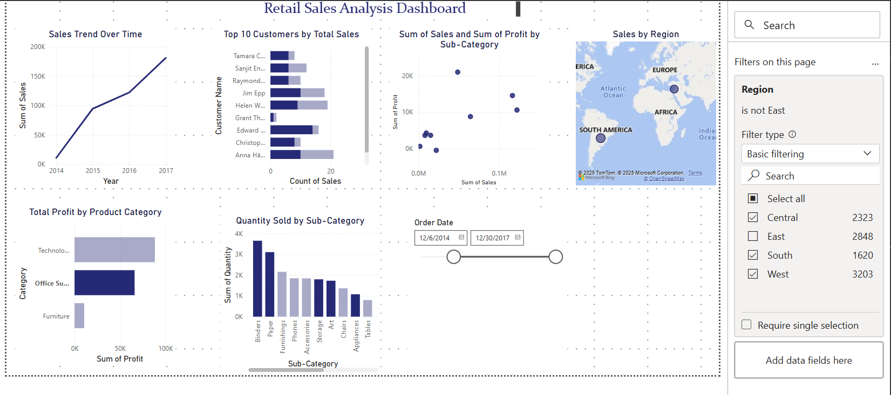

📸 

# 🛒 Retail ETL Pipeline

This project showcases a scalable ETL pipeline using Python, SQL, and Power BI, built around a real-world retail dataset. It covers data extraction, transformation, loading, querying, and dashboarding.

---

## 📦 Dataset

- [Superstore Sales Dataset](https://www.kaggle.com/datasets/vivek468/superstore-dataset-final)
- Contains order, customer, shipping, and profit details.

---


## 🔧 Technologies Used

- **Python** – Core scripting for ETL
- **Pandas** – Data transformation
- **SQLite** – Local data storage
- **SQL** – Analysis and querying
- **Power BI** – Dashboarding
- **Modular Structure** – Separate scripts for each pipeline stage

---

## ⚙️ Setup

```bash
pip install -r requirements.txt
python scripts/extract.py
python scripts/transform.py
python scripts/load.py

````

-----


## 📁 Project Structure

```
retail-etl-pipeline/
├── data/               # Raw input data (e.g., source CSV)
├── notebooks/          # Jupyter notebooks for EDA/SQL exploration
├── output/             # Final outputs from the pipeline
│   ├── retail.db       # SQLite database file
│   ├── Retail_ETL_Dashboard.pbix # Power BI Dashboard file
│   ├── charts/         # (Optional) Exported chart images
│   └── exports/        # (Optional) Exported data files
├── sql/                # SQL queries used for analysis/dashboarding
├── scripts/            # Modular ETL scripts (extract.py, transform.py, load.py)
├── requirements.txt    # Python dependencies
├── .gitignore          # Git ignore file
└── README.md           # Project README
```

-----

## 📊 Power BI Dashboard

The Power BI dashboard provides key insights into the retail data, including:

  * ✅ Total Sales per Region
  * ✅ Top Products by Sales
  * ✅ Profit by Category
  * ✅ Monthly Sales Trend
  * ✅ Customer Frequency
  * ✅ Interactive Filters for Region, Category, etc.

**Dashboard Preview:** 📸 

-----

## 🧠 SQL Practice

Explore various SQL queries used for data analysis and dashboard integration. Key queries include:

```sql
-- Top 10 Selling Products
SELECT [Product Name], SUM(Sales) AS Total_Sales
FROM superstore
GROUP BY [Product Name]
ORDER BY Total_Sales DESC
LIMIT 10;
```

These and other analytical queries are stored in the `sql/` directory:

```
sql/
├── top_10_products.sql
├── total_sales_by_region.sql
├── monthly_sales.sql
├── customer_frequency.sql
├── cumulative_sales_by_month.sql
```

-----

## ▶️ How to Run

1.  **Clone the repository:**

    ```bash
    git clone [https://github.com/yourusername/retail-etl-pipeline.git](https://github.com/yourusername/retail-etl-pipeline.git)
    cd retail-etl-pipeline
    ```

2.  **Set up your Python environment:**

    ```bash
    python -m venv venv
    source venv/bin/activate  # On Windows: `venv\Scripts\activate`
    pip install -r requirements.txt
    ```

3.  **Run the ETL pipeline scripts:**

    ```bash
    python scripts/extract.py
    python scripts/transform.py
    python scripts/load.py
    ```

    After running these scripts, the `retail.db` SQLite database and `Retail_ETL_Dashboard.pbix` (if included and pre-built) will be available in the `output/` directory.

-----

## 🚀 Future Enhancements

  * Migrate the database to a cloud-based solution like **Azure SQL** for production scalability.
  * Automate the ETL process using orchestration tools such as **Apache Airflow**.
  * Add comprehensive unit tests and robust logging for better maintainability and error tracking.
  * Apply Machine Learning models for advanced analytics like sales forecasting and customer segmentation.

-----

## 🙋 Author

**Venu Madhuri Yerramsetti**

  * [LinkedIn Profile](https://www.linkedin.com/in/venu-madhuri-yerramsetti-349057aa)
  * Email: venumadhuri.y@gmail.com

<!-- end list -->

```
```


---
